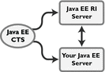

[[setup-and-configuration]]
= Setup and Configuration

This chapter describes how to set up the Jakarta EE {tck_version} Platform TCK test suite and
configure it to work with your test environment. It is recommended that
you first set up the testing environment using the Jakarta EE {tck_version} CI and then
with your Jakarta EE {tck_version} server.

This chapter includes the following topics:

* <<allowed-modifications>>
* <<configuring-the-test-environment>>
* <<configuring-a-jakarta-ee-11-server>>
* <<modifying-environment-settings-for-specific-technology-tests>>

[[allowed-modifications]]
== Allowed Modifications

You can modify the following test suite components only:

* Your implementation of the porting package
* `ts.jte` environment file
* The vendor-specific SQL files in `<TS_HOME>/sql`
* Any files in `<TS_HOME>/bin` and `<TS_HOME>/bin/xml`

[[configuring-the-test-environment]]
== Configuring the Test Environment

The instructions in this section and in <<configuring-your-application-server-as-the-vi>> step you through the configuration process for the Linux and Microsoft Windows.

All TCK test configuration procedures are based on running the Ant
scripts against a set of build targets. The primary location of any
configuration settings you are likely to make is the
`<TS_HOME>/bin/ts.jte` environment file. You may also want to modify the
`javaee_vi.xml` and `initdb.xml` Ant configuration files and the
vendor-specific SQL files. These two files contain predefined Ant
targets that are implemented such that they automatically configure the
Jakarta EE {tck_version} CI and its associated database in order to pass the TCK. An
Implementer may choose to implement these targets to work with their server
environment to perform the steps described in <<configuring-your-application-server-as-the-vi>>.

[[sthref15]]

=== Before You Begin

In these instructions, variables in angle brackets need to be expanded
for each platform. For example, `<TS_HOME>` becomes `$TS_HOME` on
Solaris/Linux and `%TS_HOME%` on Windows. In addition, the forward
slashes (`/`) used in all of the examples need to be replaced with
backslashes (`\`) for Windows.

1.  Identify the software pieces and assemble them into the Jakarta EE {tck_version}
platform to be tested for certification.
2.  Implement the porting package APIs. +
Some functionality in the Jakarta EE {tck_version} platform is not completely specified
by an API. To handle this situation, the Jakarta EE {tck_version} Platform TCK test suite
defines a set of interfaces which serve to abstract any implementation-specific code. You must create your own implementations of the porting package interfaces to work with your
particular Jakarta EE {tck_version} server environment. See
<<implementing-the-porting-package>> for
additional information about the porting APIs. API documentation for the
porting package interfaces is available in the `<TS_HOME>/docs/api`
directory.
3.  Set up the Jakarta Platform, Enterprise Edition Compatible
Implementation (CI) server. See <<configuring-the-java-ee-ci-as-the-vi>> for a list of the modifications that must be made to run CTS against the Jakarta EE {tck_version} CI.
4.  Set up the vendor's Jakarta EE {tck_version} server implementation (VI). 
See <<configuring-your-application-server-as-the-vi>> for a list of the modifications that must be made to run CTS against the vendor's Jakarta EE {tck_version} server.
5.  Validate your configuration. Run the sample tests provided. If the tests pass, your basic
configuration is valid. See <<[validating-your-test-configuration>> for information about using Maven/Arquillian to run the sample tests.
6.  Run the TCK tests. See <<executing-tests>> for information
about using Maven to start running tests.

[[configuring-a-jakarta-ee-11-server]]
== Configuring a Jakarta EE {tck_version} Server

This section describes how to configure the Jakarta EE {tck_version} server under test.
You can run the TCK tests against the Jakarta EE {tck_version} CI or your own Jakarta
Platform, Enterprise Edition server. When performing interoperability
(interop) tests or web service-based tests, you will be running two Jakarta
EE {tck_version} CI servers, one of which must be a Jakarta EE {tck_version} CI using, or configured to use a database. For example, Eclipse {glassfish_version} is bundled and configured to use the Apache Derby database.

For the purposes of this section, it is useful to clarify three terms as
they are used here:

* Compatible Implementation (CI): Jakarta EE {tck_version} CI, for example, {glassfish_version}
* Vendor Implemention (VI): Jakarta EE {tck_version} implementation from a vendor wanting to certify; typically, the goal of running the TCK is to certify a Jakarta
EE {tck_version} VI; in some cases, for purposes of familiarizing yourself with TCK,
you may choose to run the Jakarta EE {tck_version} CI as the VI
* Bundled Derby: Apache Derby database bundled with the Jakarta EE {tck_version} CI, Eclipse {glassfish_version}

[[java-platform-enterprise-edition-server-configuration-scenarios]]
== Jakarta Platform, Enterprise Edition Server Configuration Scenarios

There are three general scenarios for configuring Jakarta EE {tck_version} servers for
Jakarta EE {tck_version} Platform TCK testing (Note: in the following images, Java EE refers to Jakarta EE.
RI should be replaced with CI for Compatible Implementation):

* Configure the Jakarta EE {tck_version} CI as the server under test +

Use the Jakarta EE {tck_version} CI as the Jakarta EE {tck_version} VI; you may want to do this as a
sanity check to make sure you are comfortable with using the Jakarta EE {tck_version}
TCK against a known standard CI with certified sample applications
before proceeding with tests against your Jakarta EE {tck_version} VI. See
<<configuring-the-java-ee-ci-as-the-vi>> for instructions.

* Configure your Jakarta EE {tck_version} VI as Server Under Test +

This is the primary goal of using the Jakarta EE {tck_version} Platform TCK; you will eventually
need to configure the Jakarta EE {tck_version} implementation you want to certify. See
<<configuring-your-application-server-as-the-vi>> for instructions.

* Configure two Jakarta EE {tck_version} servers for the purpose of interop testing +

Rebuildable tests require that you configure two Jakarta
EE {tck_version} servers on one or two machines. One server will be your Jakarta EE {tck_version}
VI running a database of your choice with JDBC 4.1-compliant drivers.
The second server must be the Jakarta EE {tck_version} CI using the bundled Java DB
database. 

In terms of the Jakarta EE {tck_version} Platform TCK, all TCK configuration settings are made
in the `<TS_HOME>/bin/ts.jte` file. When configuring a Jakarta EE {tck_version} server,
the important thing is to make sure that the settings you use for your
server match those in the `ts.jte` file.

These configuration scenarios are described in the following sections.

[[configuring-the-java-ee-ci-as-the-vi]]
== Configuring the Jakarta EE {tck_version} CI as the VI

To configure the Jakarta EE {tck_version} CI as the server under test (that is, to use
the Jakarta EE {tck_version} CI as the VI) follow the steps listed below. In this
scenario, the goal is simply to test the Jakarta EE {tck_version} CI against the CTS
for the purposes of familiarizing yourself with TCK test procedures. You
may also want to refer to the Quick Start guides included with the Jakarta
EE {tck_version} TCK for similar instructions.

. Set server properties in your `<TS_HOME>/bin/ts.jte` file to suit
your test environment. +
Be sure to set the following properties:
..  Set the `webServerHost` property to the name of the host on which
your Web server is running that is configured with the CI. +
The default setting is `localhost`.
..  Set the `webServerPort` property to the port number of the host on
which the Web server is running and configured with the CI. +
The default setting is `8001`.
..  Set the database-related properties in the `<TS_HOME>/bin/ts.jte`
file. <<c.3-database-properties-in-ts.jte>>lists the names and descriptions for the database properties
you need to set.
.  Install the Jakarta EE {tck_version} CI and configure basic settings, as described
in <<installation>>
.  Start the Jakarta EE {tck_version} CI application server.
Refer to the application server documentation for complete instructions.
.  Change to the `<TS_HOME>/bin` directory.
.  Start your backend database.
    If you are using Derby as your backend database, execute the
    `start.javadb` Ant target:
    [source,oac_no_warn]
    ----
    ant -f xml/impl/glassfish/s1as.xml start.javadb
    ----
    Otherwise, refer to your backend database administration documentation
    for information about starting your database server.
    .  Initialize your backend database.
    If you are using Derby as your backend database, execute the
    `init.derby` Ant target:
    [source,oac_no_warn]
    ----
    ant -f xml/init.xml init.derby
    ----
    If you are not using Derby as your backend database, refer to
   <<c-configuring-your-backend-database>>
    [NOTE]
    =======================================================================
    If you are using MySQL or MS SQL Server as your backend database, see
    <<backend-database-setup>> for additional
    database setup instructions.
    =======================================================================
.  Run the configuration Ant target.
    [source,oac_no_warn]
    ----
    ant config.vi
    ----
    [NOTE]
    =======================================================================
    By default, the `config.vi` Ant task configures the entire application
    server. Sometimes you may not want or need to configure everything, such
    as connector RAR files. If you are not performing connector-related
    tests, you can avoid the deployment and configuration of RAR files by
    using the Ant option `-Dskip.config.connector=true`. This will reduce
    configuration times, the deployment of unneeded RAR files, and the
    creation of unnecessary resources on the server under test. For example,
    the following command will do this.
    [source,oac_no_warn]
    ----
    ant -Dskip.config.connector=true config.vi
    ----
    =======================================================================

. Continue on to <<executing-tests>> for instructions on running tests.

[[configuring-your-application-server-as-the-vi]]
== Configuring Your Application Server as the VI

To use a Jakarta EE {tck_version} server other than the Jakarta EE {tck_version} CI, follow the steps
below.

.  Set server properties in your `<TS_HOME>/bin/ts.jte` file to suit
your test environment. +
Be sure to set the following properties:

..  Set the `webServerHost` property to the name of the host on which
your Web server is running that is configured with the CI. +
The default setting is `localhost`.

..  Set the `webServerPort` property to the port number of the host on
which the Web server is running and configured with the CI. +
The default setting is `8001`.

..  Set the `wsgen.ant.classname` property to the Vendor's
implementation class that mimics the CI Ant task that in turn calls the
`wsgen` Java-to-WSDL tool. +
The default setting is `com.sun.tools.ws.ant.WsGen`.

..  Set the `wsimport.ant.classname` property to the Vendor's
implementation class that mimics the CI Ant task that in turn calls the
`wsimport` WSDL-to-Java tool. +
The default setting is `com.sun.tools.ws.ant.WsImport`.

..  Set the `porting.ts.url.class` property to your porting
implementation class that is used for obtaining URLs.

..  Set the database-related properties in the `<TS_HOME>/bin/ts.jte`
file. <<c.3-database-properties-in-ts.jte>> lists the names and descriptions for the database properties you need to set.

.  Install the Jakarta Platform, Enterprise Edition VI and configure basic
settings. +
If you want to configure your Jakarta Platform, Enterprise Edition server
using Ant configuration target similar to the target for the Jakarta EE {tck_version} CI, as described in <<installation>>
you will need to modify the `<TS_HOME>/bin/xml/javaee_vi.xml` file to
implement the defined Ant targets for your application server. Then run:
+
[source,oac_no_warn]
----
ant config.vi

----
+
The Ant configuration targets you implement, if any, may vary. Whichever
configuration method you choose, make sure that all configuration steps
in this procedure are completed as shown.

.  Provide alternate endpoint and WSDL URLs, if necessary. +
The `<TS_HOME>/bin` directory contains the following `.dat` files:
* `jaxws-url-props.dat`
* `jws-url-props.dat`
* `webservices12-url-props.dat` 
+
These files contain the webservice endpoint and WSDL URLs that the CTS
tests use when running against the CI. In the porting package used by
the TCK, the URLs are returned as is since this is the form that the CI
expects. You may need an alternate form of these URLs to run the CTS
tests in your environment. However, you MUST NOT modify the existing
`.dat` files, but instead make any necessary changes in your own porting
implementation class to transform the URLs appropriately for your
environment.

.  Install and configure a database for the server under test.

.  Start your database.

.  Initialize your database for TCK tests.

..  If you choose to not implement the `javaee_vi.xml` targets, execute
the following command to specify the appropriate DML file: +
(Derby DB Example) 

[source,oac_no_warn]
----
ant -Dtarget.dml.file=tssql.stmt 
-Ddml.file=javadb/javadb.dml.sql copy.dml.file
----

..  Execute the following command to initialize your particular
database: 

[source,oac_no_warn]
----
ant -f <TS_HOME>/bin/xml/initdb.xml init.Database
----

For example, to initialize a Derby DB database: 

[source,oac_no_warn]
----
ant -f <TS_HOME>/bin/xml/initdb.xml init.javadb

----

Refer to <<c-configuring-your-backend-database>> for detailed database configuration and
initialization instructions and a list of database-specific
initialization targets.

.  Start your Jakarta EE {tck_version} server.

.  [[BABDADHA]] Set up required users and passwords.

..  Set up database users and passwords that are used for JDBC
connections. +
The Jakarta EE {tck_version} Platform TCK requires several user names, passwords, and
user-to-role mappings. These need to match those set in your `ts.jte`
file. By default, `user1`, `user2`, `user3, password1`, `password2`, and
`password3` are set to `cts1`.

..  [[BABBHFAI]] Set up users and passwords for your Jakarta Platform, Enterprise Edition
server. +
For the purpose of running the TCK test suite, these should be set as
follows: 

.User Password Groups
[width="100%",cols="33%,33%,34%",options="header",]
|====================
|User |Password |Groups
|`j2ee_vi` |`j2ee_vi` |`staff`
|`javajoe` |`javajoe` |`guest`
|`j2ee` |`j2ee` |`staff`, `mgr`, `asadmin`
|`j2ee_ri` |`j2ee_ri` |`staff`
|====================

. Make sure that the appropriate JDBC 4.1-compliant database driver
class, any associated database driver native libraries, and the correct
database driver URL are available.

. Configure your Jakarta Platform, Enterprise Edition server to use the
appropriate JDBC logical name (`jdbc/DB1`) when accessing your database
server.

. Configure your Jakarta EE {tck_version} server to use the appropriate logical name
(`jdbc/DBTimer`) when accessing your Jakarta Enterprise Beans timer.

. Provide access to a JNDI lookup service.

. Provide access to a Web server.

. Provide access to a Jakarta Mail server that supports the SMTP protocol.

. Execute the `add.interop.certs` Ant target. +
+
[NOTE]
======================================================================

This step installs server side certificates for interoperability
testing; that is, it installs the CI's server certificate to VI and VI's
server certificate into the CI. This step is necessary for mutual
authentication tests in which both the server and client authenticate to
each other.

======================================================================
+

. [[BABEGCJH]] Install the client-side certificate in the `trustStore` on the Jakarta EE {tck_version}
server.  +
Certificates are located `<TS_HOME>/bin/certificates`. Use the
certificate that suits your environment.

..  `cts_cert`: For importing the TCK client certificate into a
`truststore`

..  `clientcert.jks`: Used by the Java SE 8 runtime to identify the CTS
client's identity

..  `clientcert.p12`: Contains TCK client certificate in `pkcs12` format

.. Append the file `<TS_HOME>/bin/server_policy.append` to the Java
policy file or files on your Jakarta EE {tck_version} server. +
This file contains the grant statements used by the test harness,
signature tests, and API tests.

.. Append the file `<TS_HOME>/bin/client_policy.append` to the
application client's Java policy file, which is referenced in the
`TestExecuteAppClient` section of the `ts.jte` file.

.. Make the appropriate transaction interoperability setting on the
Jakarta EE {tck_version} server and the server that is running the Jakarta EE {tck_version} CI. +

.. If necessary, refer to the sections later in this chapter for
additional configuration information you may require for your particular
test goals. +

.. Restart your Jakarta EE {tck_version} server.

.. Install the Jakarta EE {tck_version} CI.

.. Set the following properties in your `<TS_HOME>/bin/ts.jte` file. +
The current values should be saved since they will be needed later in this step.

* Set the `javaee.home.ri` property to the location where the Jakarta EE {tck_version}
CI is installed.

. Continue on to <<executing-tests>.

[[modifying-environment-settings-for-specific-technology-tests]]
== Modifying Environment Settings for Specific Technology Tests

Before you can run any of the technology-specific Jakarta EE {tck_version} Platform TCK tests,
you must supply certain information that JavaTest needs to run the tests
in your particular environment. This information exists in the
`<TS_HOME>/bin/ts.jte` environment file. This file contains sets of
name/value pairs that are used by the tests. You need to assign a valid
value for your environment for all of the properties listed in the
sections that follow.

[NOTE]
======================================================================

This section only discusses a small subset of the properties you can
modify. Refer to the `ts.jte` file for information about the many other
properties you may want to modify for your particular test environment.

======================================================================

This section includes the following topics:

* <<test-harness-setup>>
* <<windows-specific-properties>>
* <<test-execution-command-setup>>
* <<jakarta-servlet-test-setup>>
* <<jakarta-websocket-test-setup>>
* <<jdbc-test-setup>>
* <<jakarta-mail-test-setup>>
* <<jakarta-restful-web-services-test-setup>>
* <<jakarta-connector-test-setup>>
* <<xa-test-setup>>
* <<jakarta-enterprise-beans-3.2-test-setup>>
* <<ejb-timer-test-setup>>
* <<jakarta-persistence-api-test-setup>>
* <<jakarta-messaging-test-setup>>
* <<jakarta-security-api-test-setup>>
* <<signature-test-setup>>
* <<backend-database-setup>>

[[test-harness-setup]]
=== Test Harness Setup

Verify that the following properties, which are used by the test
harness, have been set in the `<TS_HOME>/bin/ts.jte` file:

[source,oac_no_warn]
----
harness.temp.directory=<TS_HOME>/tmp
harness.log.port=2000
harness.log.traceflag=[true | false]
deployment_host.1=<hostname>
deployment_host.2=<hostname>
porting.ts.login.class.1=<vendor-login-class>
porting.ts.url.class.1=<vendor-url-class>
porting.ts.jms.class.1=<vendor-jms-class>
porting.ts.tsHttpsURLConnection.class.1=<vendor-HttpsURLConnection-class>
----

* The `harness.temp.directory` property specifies a temporary directory
that the harness creates and to which the TCK harness and tests write
temporary files. The default setting should not need to be changed.

* The `harness.log.port` property specifies the port that server
components of the tests use to send logging output back to JavaTest. If
the default port is not available on the machine running JavaTest, you
must edit this property and set it to an available port. The default
setting is `2000`.

* The `harness.log.traceflag` property is used to turn on or turn off
verbose debugging output for the tests. The value of the property is set
to `false` by default. Set the property to `true` to turn debugging on.

* The `deployment_host.1` and `deployment_host.2` properties specify the
systems where the vendor's Jakarta Platform, Enterprise Edition server and
the Jakarta Platform, Enterprise Edition CI server are running. By default,
JavaTest will use the `orb.host` and `orb.host.ri` systems, which are
set in the `ts.jte` file.

* The porting class `.1` and `.2` property sets specify the class names
of porting class implementations. By default, both property sets point
to the Jakarta Platform, Enterprise Edition CI-specific classes. To run the
interoperability tests, do not modify the `.2` set. These properties
should always point to the Jakarta Platform, Enterprise Edition CI classes.
Modify the `.1` set to point to implementations that work in your
specific Jakarta Platform, Enterprise Edition environment.

* The `-Dcts.tmp` option for the `testExecute` and
`testExecuteAppClient` commands in the `ts.jte` file have been set. This
Java option tells the test suite the location to which the test suite
will write temporary files.

[[windows-specific-properties]]
=== Windows-Specific Properties

When configuring the Jakarta EE {tck_version} Platform TCK for the Windows environment, set the
following properties in `<TS_HOME>/bin/ts.jte`:

* `pathsep` to semicolon (pathsep=`;`)

* `s1as.applicationRoot` to the drive on which you have installed CTS
(for example, `s1as.applicationRoot=C:`) +
When installing in the Windows environment, the Jakarta Platform,
Enterprise Edition CI, JDK, and TCK should all be installed on the same
drive. If you must install these components on different drives, also
change the `ri.applicationRoot` property in addition to the `pathsep`
and `s1as.applicationRoot` properties; for example: +
[source,oac_no_warn]
----
ri.applicationRoot=C:
----

[NOTE]
======================================================================

When configuring the CI and TCK for the Windows environment, never
specify drive letters in any path properties in `ts.jte`.

======================================================================

[[test-execution-command-setup]]
=== Test Execution Command Setup

The test execution command properties are used by the test harness. By
default, the `ts.jte` file defines a single command line for each of the
commands that is used for both UNIX and Windows environments.

* `command.testExecute`

* `command.testExecuteAppClient`

* `command.testExecuteAppClient2`

If these commands do not meet your needs, you can define separate
entries for the UNIX and Windows environments. Edit either the `ts_unix`
or `ts_win32` test execution properties in the `ts.jte` file. For UNIX,
these properties are:

* `env.ts_unix.command.testExecute`

* `env.ts_unix.command.testExecuteAppClient`

* `env.ts_unix.command.testExecuteAppClient2`

For Windows, these properties are:

* `env.ts_win32.command.testExecute`

* `env.ts_win32.command.testExecuteAppClient`

* `env.ts_win32.command.testExecuteAppClient2`

The `testExecute` property specifies the Java command that is used to
execute individual tests from a standalone URL client. Tests in which
the client directly invokes a web component (Jakarta Servlet or Jakarta Server Pages), use this
command line since there is no application client container involved.

[NOTE]
======================================================================

The default settings are specific to the Jakarta Platform, Enterprise
Edition CI. If you are not using the Jakarta Platform, Enterprise Edition
CI, adjust these properties accordingly.

======================================================================

[[jakarta-servlet-test-setup]]
=== Jakarta Servlet Test Setup

Make sure that the following servlet properties have been set in the
`ts.jte` file:

[source,oac_no_warn]
----
ServletClientThreads=[2X size of default servlet instance pool] 
servlet_waittime=[number_of_milliseconds]
servlet_async_wait=[number_of_seconds]
logical.hostname.servlet=server
s1as.java.endorsed.dirs=${endorsed.dirs}${pathsep}${ts.home}/endorsedlib
----

The `servlet_waittime` property specifies the amount of time, in
milliseconds, to wait between the time when the `HttpSession` is set to
expire on the server and when the `HttpSession` actually expires on the
client. This time is configurable to allow the servlet container enough
time to completely invalidate the `HttpSession`. The default value is 10
milliseconds.

The test `serverpush` in Jakarta Servlet 6.0, uses `httpclient`, a new library
in JDK9 that depends on `java.util.concurrent.flow` (also new class in JDK9).

The `servlet_async_wait` property sets the duration of time in seconds
to wait between sending asynchronous messages. This property is used in
place to test non-interrupted IO, where two messages are sent in two
different batches and the receiving end will be read in a different read
cycle. This property sets the time to wait in seconds on the sending
side. The default is 4 seconds.

The `logical.hostname.servlet` property identifies the configuration
name of the logical host on which the `ServletContext` is deployed. This
used to identify the name of a logical host that processes Jakarta EE {tck_version}
requests. Jakarta EE {tck_version} requests may be directed to a logical host using
various physical or virtual host names or addresses, and a message
processing runtime may be composed of multiple logical hosts. The
`logical.hostname.servlet` property is required to properly identify the
Jakarta EE {tck_version} profile's `AppContextId` hostname. This property is used by
the Jakarta EE {tck_version} security tests as well as by the
`ServletContext.getVirtualServerName()` method. If a
`logical.hostname.servlet` does not exist, set this property to the
default hostname (for example, `webServerHost`). The default is
"server".

[[jakarta-websocket-test-setup]]
=== Jakarta WebSocket Test Setup

Make sure that the following WebSocket property has been set in the
`ts.jte` file:

[source,oac_no_warn]
----
ws_wait=[number_of_seconds]
----

The `ws_wait` property configures the wait time, in seconds, for the
socket to send or receive a message. A multiple of 5 of this time is
also used to test socket timeouts.

The Jakarta WebSocket tests also use the following properties: `webServerHost`
and `webServerPort`. See <<configuring-the-java-ee-ci-as-the-vi>> for more information about setting these
properties.

[NOTE]
======================================================================

The SSL related tests under
`/ts/javaeetck/src/com/sun/ts/tests/websocket/platform/jakarta/websocket/server/handshakerequest/authenticatedssl/`
use self signed certificate bundled with the TCK bundle. These
certificates are generated with localhost as the hostname and would work
only when orb.host value is set to localhost in ts.jte. If the server's
hostname is used instead of the localhost, the tests in this suite might
fail with the below exception - jakarta.websocket.DeploymentException: SSL
handshake has failed.

======================================================================

[[jdbc-test-setup]]
=== JDBC Test Setup

The JDBC tests require you to set the timezone by modifying the `tz`
property in the `ts.jte` file. On Solaris systems, you can check the
timezone setting by looking in the file `/etc/default/init`. Valid
values for the `tz` property are in the directory
`/usr/share/lib/zoneinfo`. The default setting is `US/Eastern`. This
setting is in `/usr/share/lib/zoneinfo/US`.

[NOTE]
======================================================================

The `tz` property is only used for Linux configurations; it does not
apply to Windows XP/2000.

======================================================================

[[jakarta-mail-test-setup]]
=== Jakarta Mail Test Setup (Full Platform Only)

Complete the following tasks before you run the Jakarta Mail tests:

.  Set the following properties in the `ts.jte` file: 
+
[source,oac_no_warn]
----
mailuser1=[user@domain]
mailFrom=[user@domain]
mailHost=mailserver
javamail.password=password
----
+
* Set the `mailuser1` property to a valid mail address. Mail messages
generated by the Jakarta Mail tests are sent to the specified address. This
user must be created in the IMAP server.

* Set the `mailFrom` property to a mail address from which mail messages
that the Jakarta Mail tests generate will be sent.

* Set the `mailHost` property to the address of a valid mail server
where the mail will be sent.

* Set the `javamail.password` property to the password for `mailuser1`.

.  Populate your IMAP server with sample messages. +
Change to the `<TS_HOME>/bin` directory and execute the Ant target
`populateMailbox` to create the sample messages in your IMAP server. 
+
[source,oac_no_warn]
----
cd <TS_HOME>/bin
ant populateMailbox
----

[[jakarta-restful-web-services-test-setup]]
=== Jakarta RESTful Web Services Test Setup

This section explains how to set up the test environment to run the
Jakarta RESTful Web Services tests using the Jakarta EE {tck_version} Compatible Implementation and/or a Vendor Implementation. This setup also includes steps for
packaging/repackaging and publishing the packaged/repackaged WAR files
as well.

[[to-configure-your-environment-to-run-the-jakarta-restful-web-services-tests-against-the-jakarta-ee-8-ci]]
==== To Configure Your Environment to Run the Jakarta RESTful Web Services Tests Against the Jakarta EE {tck_version} CI

Copy <TS_HOME>/bin/ts.jte.jdk11 as <TS_HOME>/bin/ts.jte if JAVA_HOME is Java SE 11.
Edit your `<TS_HOME>/bin/ts.jte` file and set the following environment
variables:

.  Set the `jaxrs_impl_lib` property to point to the Jakarta RESTful Web Services CI. +
The default setting for this property is
`${javaee.home}/modules/jersey-container-servlet-core.jar` .

.  Set the `servlet_adaptor` property to point to the Servlet adapter
class for the Jakarta RESTful Web Services implementation. +
The default setting for this property is
`org/glassfish/jersey/servlet/ServletContainer.class`, the servlet
adaptor supplied in Jersey.

.  Set the `jaxrs_impl_name` property to the name of the Jakarta RESTful Web Services CI. +
The default setting for this property is `jersey`. +
An Ant script, jersey.xml, in the `<TS_HOME>/bin/xml/impl/glassfish`
directory contains packaging instructions.

[[package-war-files-for-deployment-jakarta-ee-ci]]
==== To Package WAR files for Deployment on the Jakarta EE {tck_version} CI

The Jakarta EE {tck_version} Platform TCK test suite does not come with prebuilt test WAR files
for deployment on Jakarta EE {tck_version} CI. The test suite includes a command to
generate the test WAR files that will be deployed on the Jakarta EE {tck_version} CI.
The WAR files are Jersey-specific, with Jersey's servlet class and
Eclipse Jersey's servlet defined in the `web.xml` deployment descriptor.

To package the Jakarta RESTful Web Services WAR files for deployment on the Jakarta EE {tck_version} CI,
complete the following steps:

.  Change to the `<TS_HOME>/bin` directory.

.  Execute the `update.jaxrs.wars` Ant target. +
In a test WAR files that has the `servlet_adaptor` property defined,
this target replaces the `servlet_adaptor` value of the servlet class
name property in the `web.xml` file of the WAR files to be deployed on
the Jakarta EE {tck_version} CI.

[[configure-run-jaxrs-tests-against-vi]]
==== To Configure Your Environment to Run the Jakarta RESTful Web Services Tests Against a Vendor Implementation

Complete the following steps to configure your test environment to run
the Jakarta RESTful Web Services tests against your vendor implementation. Before you can run
the tests, you need to repackage the WAR files that contain the Jakarta RESTful Web Services
tests and the VI-specific Servlet class that will be deployed on the
vendor's Jakarta EE {tck_version}-compliant application server.

Copy <TS_HOME>/bin/ts.jte.jdk11 as <TS_HOME>/bin/ts.jte if JAVA_HOME is Java SE 11.
Edit your `<TS_HOME>/bin/ts.jte` file and set the following properties:

.  Set the `jaxrs_impl_lib` property to point to the JAR file that
contains the vendor's Jakarta RESTful Web Services Servlet adapter implementation. +
The default setting for this property is
`${javaee.home}/modules/jersey-container-servlet-core.jar` .

.  Set the `servlet_adaptor` property to point to the Servlet adapter
class for the vendor's Jakarta RESTful Web Services implementation. +
The class must be located in the JAR file defined by the
`jaxrs_impl_lib` property. By default, this property is set to
`org/glassfish/jersey/servlet/ServletContainer.class`, the servlet
adapter supplied in Jersey.

.  Set the `jaxrs_impl_name` property to the name of the Jakarta RESTful Web Services vendor
implementation to be tested. +
The name of the property must be unique. An Ant file bearing this name,
<jaxrs_impl_name>.xml, should be created under
`<TS_HOME>/bin/xml/impl/${impl.vi}` with packaging and/or deployment
instructions as described in <<repackage-war-files-for-deployment-on-the-vi>> +
The default setting for this property is `jersey`.

[[repackage-war-files-for-deployment-on-the-vi]]
==== To Repackage WAR files for Deployment on the Vendor Implementation

To run the Jakarta RESTful Web Services tests against a vendor's implementation in a Jakarta EE {tck_version} compliant application server, the tests need to be repackaged to
include the VI-specific servlet, and the VI-specific servlet must be
defined in the deployment descriptor.

A vendor must create VI-specific Jakarta EE {tck_version}-compliant WAR files so the
VI-specific Servlet class will be included instead of the Jakarta EE {tck_version}
CI-specific Servlet class.

All resource and application class files are already compiled. The
Vendor needs to package these files. Jakarta EE {tck_version} Platform TCK makes this task
easier by including template WAR files that contain all of the necessary
files except for the VI-specific servlet adaptor class. The Jakarta EE {tck_version}
TCK also provides a tool to help with the repackaging task.

Each test that has a Jakarta RESTful Web Services resource class to publish comes with a
template deployment descriptor file. For example, the file
`<TS_HOME>/src/com/sun/ts/tests/jaxrs/ee/rs/get/web.xml.template`
contains the following elements:

[source,oac_no_warn]
----
<?xml version="1.0" encoding="UTF-8"?>
<web-app version="2.5" xmlns="http://java.sun.com/xml/ns/javaee" \
xmlns:xsi="http://www.w3.org/2001/XMLSchema-instance" \
xsi:schemaLocation="http://java.sun.com/xml/ns/javaee \
http://java.sun.com/xml/ns/javaee/web-app_2_5.xsd">
    <servlet>
        <servlet-name>CTSJAX-RSGET</servlet-name>
        <servlet-class>servlet_adaptor</servlet-class> 
        <init-param>
            <param-name>jakarta.ws.rs.Application</param-name>
            <param-value>com.sun.ts.tests.jaxrs.ee.rs.get.TSAppConfig</param-value>
        </init-param>
        <load-on-startup>1</load-on-startup>
    </servlet>
    <servlet-mapping>
        <servlet-name>CTSJAX-RSGET</servlet-name>
        <url-pattern>/*</url-pattern>
    </servlet-mapping>
    <session-config>
        <session-timeout>30</session-timeout>
    </session-config>
</web-app>
----

In this example, the `<servlet-class>` element has a value of
`servlet_adaptor`, which is a placeholder for the
implementation-specific Servlet class. An Eclipse Jersey-specific deployment
descriptor also comes with the Jakarta EE {tck_version} CI, Eclipse {glassfish_version}, and has the values for the
`com.sun.jersey.spi.container.servlet.ServletContainer`:

[source,oac_no_warn]
----
<?xml version="1.0" encoding="UTF-8"?>
<web-app version="2.5" xmlns="http://java.sun.com/xml/ns/javaee" \
xmlns:xsi="http://www.w3.org/2001/XMLSchema-instance" \
xsi:schemaLocation="http://java.sun.com/xml/ns/javaee \
http://java.sun.com/xml/ns/javaee/web-app_2_5.xsd">
   <servlet>
        <servlet-name>CTSJAX-RSGET</servlet-name>
        <servlet-class>
        org.glassfish.jersey.servlet.ServletContainer 
        </servlet-class>
        <init-param>
            <param-name>jakarta.ws.rs.Application</param-name>
            <param-value>com.sun.ts.tests.jaxrs.ee.rs.get.TSAppConfig</param-value>
        </init-param>
        <load-on-startup>1</load-on-startup>
    </servlet>
    <servlet-mapping>
        <servlet-name>CTSJAX-RSGET</servlet-name>
        <url-pattern>/*</url-pattern>
    </servlet-mapping>
    <session-config>
        <session-timeout>30</session-timeout>
        </session-config>
</web-app>
----

The Jakarta EE {tck_version} Platform TCK test suite provides a tool,
`${ts.home}/bin/xml/impl/glassfish/jersey.xml`, for the Jakarta EE {tck_version} CI
that you can use as a model to help you create your own VI-specific Web
test application.

The following steps explain how to create a VI-specific deployment
descriptor.

.  Create a VI handler file. +
Create a VI-specific handler file
`<TS_HOME>/bin/xml/impl/${impl.vi}/${jaxrs_impl_name}.xml` if one does
not already exist. +
Ensure that the `jaxrs_impl_name` property is set in the `ts.jte` file
and that its name is unique, to prevent another file with the same name
from being overwritten.

.  Set the `servlet_adaptor` property in the `ts.jte` file. +
This property will be used to set the value of the `<servlet-class>`
element in the deployment descriptor.

.  Create VI Ant tasks. +
Create a `update.jaxrs.wars` target in the VI handler file. Reference
this `update.jaxrs.wars` target in the `jersey.xml` file. +
This target will create a `web.xml.${jaxrs_impl_name}` for each test
that has a deployment descriptor template. The
`web.xml.${jaxrs_impl_name)` will contain the VI-specific Servlet class
name. It will also create the test WAR files will be created under the
`<TS_HOME>/dist` directory. For example: 
+
[source,oac_no_warn]
----
cd $TS_HOME/dist/com/sun/ts/tests/jaxrs/ee/rs/get/
ls jaxrs_rs_get_web.war.jersey 
jaxrs_rs_get_web.war.${jaxrs_impl_name}

----
+
.  Change to the `<TS_HOME>/bin` directory and execute the
`update.jaxrs.wars` Ant target. +
This creates a `web.xml.${jaxrs_impl_name}` file for each test based on
the VI's servlet class name and repackages the tests.

[[jakarta-connector-test-setup]]
=== Jakarta Connector Test Setup (Full Platform Only)

The Jakarta Connector tests verify that a Jakarta EE {tck_version} server correctly implements the Jakarta Connector V1.7 specification. The Connector compatibility tests
ensure that your Jakarta EE {tck_version} server still supports the Connector V1.0
functionality.

The `config.vi` target is run to configure the Jakarta EE {tck_version} server for
running Connector tests. The `config.vi` target calls the
`config.connecto`r target, which is defined in
`TS_HOME/bin/xml/impl/glassfish/s1as.xml`, to deploy the RAR files
listed in <<extension-libraries>> and
create the required connection resources and connection pools used for
the Connector tests. The `config.vi` target also performs several other
tasks, such as creating required users and security mappings, setting
appropriate JVM options, etc. that also are needed to run the Connector
tests.

[[extension-libraries]]
==== Extension Libraries

The following Connector files are deployed as part of the `config.vi` Ant target:

* `whitebox-mixedmode.rar`
* `whitebox-tx-param.rar`
* `whitebox-multianno.rar`
* `whitebox-tx.rar`
* `whitebox-anno_no_md.rar`
* `whitebox-notx-param.rar`
* `whitebox-xa-param.rar`
* `whitebox-mdcomplete.rar`
* `whitebox-notx.rar`
* `whitebox-xa.rar`
* `old-dd-whitebox-notx-param.rar`
* `old-dd-whitebox-xa-param.rar`
* `old-dd-whitebox-tx.rar`
* `old-dd-whitebox-notx.rar`
* `old-dd-whitebox-xa.rar`
* `old-dd-whitebox-tx-param.rar`

[NOTE]
======================================================================

RAR files with an `old` prefix are used to test the support of RAs that
are bundled with an older version of the `ra.xml` files.  TODO: These need to
be built for the EE 11 dist.

======================================================================

The manifest file in each RAR file includes a reference to the whitebox
extension library. The `whitebox.jar` file is a Shared Library that must
be deployed as a separate entity that all the Jakarta Connector RAR files
access. This extension library is needed to address classloading issues.

The RAR files that are used with Jakarta EE {tck_version} Platform TCK test suite differ from
those that were used in earlier test suites. Jakarta EE {tck_version} Platform TCK no longer
bundles the same common classes into every RAR file. Duplicate common
classes have been removed and now exist in the `whitebox.jar` file, an
Installed Library that is deployed and is made available before any
other RAR files are deployed.

This was done to address the following compatibility issues:

* Portable use of Installed Libraries for specifying a resource
adapter's shared libraries +
See section EE.8.2.2 of the Jakarta EE {tck_version} platform specification and section
20.2.0.1 in the Jakarta Connectors (formerly JCA) 1.7 specification, which explicitly state that the
resource adapter server may employ the library mechanisms in Jakarta EE {tck_version}.

* Support application-based standalone connector accessibility +
Section 20.2.0.4 of the Jakarta Connectors (formerly JCA) 1.7 Specification uses the classloading
requirements that are listed in section 20.3 in the specification.

[[connector-resource-adapters-and-classloading]]
==== Connector Resource Adapters and Classloading

Jakarta EE {tck_version} Platform TCK has scenarios in which multiple standalone RAR files that use the same shared library (for example, `whitebox.jar`) are referenced from an application component.

Each standalone RAR file gets loaded in its own classloader. Since the
application component refers to more than one standalone RAR file, all
of the referenced standalone RAR files need to be made available in the
classpath of the application component. In versions of the TCK prior to
Java EE 5, since each standalone RAR file contained a copy of the
`whitebox.jar` file, every time there was a reference to a class in the
`whitebox.jar` file from a standalone RAR, the reference was resolved by
using the private version of `whitebox.jar` (the `whitebox.jar` file was
bundled in each standalone RAR file). This approach can lead to class
type inconsistency issues.

[[use-case-problem-scenario]]

==== Use Case Problem Scenario

Assume that RAR1 and RAR2 are standalone RAR files that are referred to
by an application, where:

* RAR1's classloader has access to RAR1's classes and its copy of
`whitebox.jar`. (RAR1's classloader contains RAR1's classes and
`whitebox.jar`)

* RAR2's classloader has access to RAR2's classes and its copy of
`whitebox.jar`. (RAR2's classloader contains RAR2's classes and
`whitebox.jar`)

When the application refers to both of these RAR files, a classloader
that encompasses both of these classloaders (thereby creating a
classloader search order) is provided to the application. The
classloader search order could have the following sequence: ([RAR1's
Classloader: RAR1's classes and whitebox.jar], [RAR2's Classloader:
RAR2's classes and whitebox.jar]).

In this scenario, when an application loads a class (for example, class
`Foo`) in `whitebox.jar`, the application gets class `Foo` from RAR1's
classloader because that is first in the classloader search order.
However, when this is cast to a class (for example, `Foo` or a subclass
of `Foo` or even a class that references `Foo`) that is obtained from
RAR2's classloader (a sequence that is typically realized in a
`ConnectionFactory` lookup), this would result in a class-cast
exception.

The portable way of solving the issues raised by this use case problem
scenario is to use installed libraries, as described in section EE.8.2.2
in the Jakarta EE {tck_version} platform specification. If both RAR files (RAR1 and
RAR2) reference `whitebox.jar` as an installed library and the
application server can use a single classloader to load this common
dependency, there will be no type-related issues.

In the CI Eclipse GlassFish 6.1, `domain-dir/lib/applibs` is used as the Installed Library
directory and is the location to which the `whitebox.jar` file gets
copied.

[[required-porting-package]]
==== Required Porting Package

The Jakarta EE {tck_version} Platform TCK test suite treats the `whitebox.jar` dependency as an
Installed Library dependency instead of bundling the dependency (or
dependencies) with every RAR file. Each RAR file now contains a
reference to the `whitebox.jar` file through its Manifest files
Extension-List attribute.

It is necessary to identify the `whitebox.jar` to the connector server
as an installed library. The mechanism used to identify the
`whitebox.jar` file to the connector server as an Installed Library must
allow the Installed Libraries to have dependencies on Jakarta EE APIs. In
other words, because the `whitebox.jar` file depends on Jakarta EE APIs,
one cannot simply put the `whitebox.jar` file into a `java.ext.dir`
directory , which gets loaded by the VM extension classloader, because
that mechanism does not allow the `whitebox.jar` file to support its
dependencies on the Jakarta EE APIs. For this reason, the Installed Library
must support access to the Jakarta EE APIs.

See section EE.8.2.2 in the Jakarta EE {tck_version} platform specification for
information about the compatible implementation's support for Installed
libraries. However, note that this section does not recommend a
mechanism that a deployer can use to provide Installed Libraries in a
portable manner.

[[creating-security-mappings--connector-rar-files]]
==== Creating Security Mappings for the Connector RAR Files

The Ant target `create.security.eis.mappings` in the
`<TS_HOME>/bin/xml/impl/glassfish/connector.xml` file maps Resource
Adapter user information to existing user information in the CI.

For the Eclipse {glassfish_version} CI, these mappings add a line to the `domain.xml` file, similar to the one shown below, and should include 6 of these mappings:

[source,oac_no_warn]
----
<jvm-options>-Dwhitebox-tx-map=cts1=j2ee</jvm-options>
<jvm-options>-Dwhitebox-tx-param-map=cts1=j2ee</jvm-options>
<jvm-options>-Dwhitebox-notx-map=cts1=j2ee</jvm-options>
<jvm-options>-Dwhitebox-notx-param-map=cts1=j2ee</jvm-options>
<jvm-options>-Dwhitebox-xa-map=cts1=j2ee</jvm-options>
<jvm-options>-Dwhitebox-xa-param-map=cts1=j2ee</jvm-options>
----

If the `rauser1` property has been set to `cts1` and the `user` property
has been set to `j2ee` in the `ts.jte` file, the following mappings
would be required in the connector runtime:

* For RA `whitebox-tx`, map `cts1` to `j2ee`
* For RA `whitebox-tx-param`, map `cts1` to `j2ee`
* For RA `whitebox-notx`, map `cts1` to `j2ee`
* For RA `whitebox-notx-param`, map `cts1` to `j2ee`
* For RA `whitebox-xa`, map `cts1` to `j2ee`
* For RA `whitebox-xa-param`, map `cts1` to `j2ee`

[[creating-required-server-side-jvm-options]]
==== Creating Required Server-Side JVM Options

Create the required JVM options that enable user information to be set
and/or passed from the `ts.jte` file to the server. The RAR files use
some of the property settings in the `ts.jte` file.

To see some of the required JVM options for the server under test, see
the `s1as.jvm.options` property in the `ts.jte` file. The connector
tests require that the following subset of JVM options be set in the
server under test:

[source,oac_no_warn]
----
-Dj2eelogin.name=j2ee
-Dj2eelogin.password=j2ee
-Deislogin.name=cts1
-Deislogin.password=cts1
----

[[xa-test-setup]]
=== XA Test Setup (Full Platform Only)

The XA Test setup requires that the `ejb_Tsr.ear` file be deployed as
part of the `config.vi` Ant target. The `ejb_Tsr.ear` file contains an
embedded RAR file, which requires the creation of a connection-pool and
a connector resource.

For more details about the deployment of `ejb_Tsr.ear` and its
corresponding connection pool and connector resource values, see the
`setup.tsr.embedded.rar` Ant target in the
`<TS_HOME>/bin/xml/impl/glassfish/s1as.xml` file.

The XA tests reference some `JDBCWhitebox` name bindings that are
created as part of the `config.vi` target but those name bindings are
not tied to any JDBC RAR files. Instead, the following XA-specific
connection pool ids are referenced by the XA tests:

* `eis/JDBCwhitebox-xa`
* `eis/JDBCwhitebox-tx`
* `eis/JDBCwhitebox-notx`

For more details on these JDBC resources, examine the
`add.jdbc.resources` target in the same file to see the required JDBC
resources that are created. Both targets are called as part of the
`config.vi` target.

Complete the following steps (create JDBC connection pools and JDBC
resource elements, deploy the RAR files) to set up your environment to
run the XA tests:

.  Create a JDBC connection pool with the following attributes:

* Set the resource type to `javax.sql.XADataSource`

* Set the datasourceclassname to
`org.apache.derby.jdbc.EmbeddedXADataSource`

* Set the property to
`DatabaseName=<Derby-location>:user=cts1:password=cts1`

* Set the connection pool name to `cts-derby-XA-pool` +
For example, you could use the `asadmin` command line utility in the
Jakarta EE {tck_version} CI, Eclipse GlassFish 6.1 to create this connection pool:
+
[source,oac_no_warn]
----
asadmin create-jdbc-connection-pool --restype javax.sql.XADataSource \
--datasourceclassname org.apache.derby.jdbc.EmbeddedXADataSource  \
--property 'DatabaseName=/tmp/DerbyDB:user=cts1:password=cts1' \
cts-derby-XA-pool
----
+
See the `add.jdbc.pools` Ant target in the `s1as.xml` file for
additional information.

.  Create three JDBC connection pool elements (more specifically, the
JDBC connection pool elements) with the following JNDI names:

* For the first connection pool element, set the connection pool id to
`cts-derby-XA-pool` and the JNDI name to `eis/JDBCwhitebox-xa`

* For the second connection pool element, set the connection pool id to
`cts-derby-XA-pool` and the JNDI name to `eis/JDBCwhitebox-tx`

* For the third connection pool element, set the connection pool id to
`cts-derby-XA-pool` and the JNDI name to `eis/JDBCwhitebox-notx` +
For example, you could use the `asadmin` command line utility in the
Jakarta EE {tck_version} CI to create the three connection pool elements:
+
[source,oac_no_warn]
----
asadmin  asadmin  create-jdbc-resource --connectionpoolid cts-derby-XA-pool \
 eis/JDBCwhitebox-xa
asadmin  create-jdbc-resource --connectionpoolid cts-derby-XA-pool \
 eis/JDBCwhitebox-tx
asadmin  create-jdbc-resource --connectionpoolid cts-derby-XA-pool \
 eis/JDBCwhitebox-notx
----
+
If two or more JDBC resource elements point to the same connection pool
element, they use the same pool connection at runtime. Jakarta EE {tck_version} Platform TCK
does reuse the same connection pool ID for testing the Jakarta EE {tck_version} CI Eclipse {glassfish_version}.

.  Make sure that the following EIS and RAR files have been deployed
into your environment before you run the XA tests:

* For the EIS resource adapter, deploy the following RAR files. Most of
these files are standalone RAR files, but there is also an embedded RAR
file that is contained in the `ejb_Tsr.ear` file. With the CI, these RAR
files are deployed as part of the config.vi Ant task. The following RAR
files are defined in the `ts.jte` file. 
+
[source,oac_no_warn]
----
whitebox-tx=java:comp/env/eis/whitebox-tx
whitebox-notx=java:comp/env/eis/whitebox-notx
whitebox-xa=java:comp/env/eis/whitebox-xa
whitebox-tx-param=java:comp/env/eis/whitebox-tx-param
whitebox-notx-param=java:comp/env/eis/whitebox-notx-param
whitebox-xa-param=java:comp/env/eis/whitebox-xa-param
whitebox-embed-xa=
"__SYSTEM/resource/ejb_Tsr#whitebox-xa#com.sun.ts.tests.common.connector.whitebox.TSConnectionFactory"
----
+
* The embedded RAR files are located in the
`<TS_HOME>/src/com/sun/ts/tests/xa/ee/tsr` directory.

* The EIS RAR files are located in the following directory:
`<TS_HOME>/src/com/sun/ts/tests/common/connector/whitebox` +
RAR files in the `<TS_HOME>/src/com/sun/ts/tests/common/connector`
directory must be built before any dependent tests can pass. Deployment
can either be done ahead of time or at runtime, as long as connection
pools and resources are established prior to test execution. +
The XA tests make use of existing connector RAR files, which typically
get deployed when the `config.vi` Ant task is run. Note that there are
currently no `JDBCwhitebox` source files and no `JDNCwhitebox` RAR
files.

[[jakarta-enterprise-beans-3.2-test-setup]]
=== Jakarta Enterprise Beans 4.0 Test Setup

This section explains special configuration that needs to be completed
before running the Jakarta Enterprise Beans 4.0 DataSource and Stateful Timeout tests.

The Jakarta Enterprise Beans 4.0 DataSource tests do not test XA capability and XA support in
a database product is typically not required for these tests. However,
some Jakarta EE products could be implemented in such a way that XA must be
supported by the database. For example, when processing the
@DataSourceDefinition annotation or `<data-source>` descriptor elements
in tests, a Jakarta EE product infers the datasource type from the
interface implemented by the driver class. When the driver class
implements multiple interfaces, such as `javax.sql.DataSource`,
`javax.sql.ConnectionPoolDataSource`, or `javax.sql.XADataSource`, the
vendor must choose which datasource type to use. If
`javax.sql.XADataSource` is chosen, the target datasource system must be
configured to support XA. Consult the documentation for your database
system and JDBC driver for information that explains how to enable XA
support.

[[configure-the-tests-ejb-datasource-tests]]
==== To Configure the Test Environment to Run the Jakarta Enterprise Beans 4.0 DataSource Tests

The EJB 3.2 DataSource tests under the following `tests/ejb30`
directories require you to run the Ant task in Step <<configure_datasource_tests>>.

* `com/sun/ts/tests/ejb30/lite/packaging/war/datasource`
* `com/sun/ts/tests/ejb30/misc/datasource`
* `com/sun/ts/tests/ejb30/assembly/appres`

If your database vendor requires you to set any vendor-specific or less
common DataSource properties, complete step <<jdbc.datasource.props>> and then
complete step <<configure_datasource_tests>>, as explained below.

.  [[jdbc.datasource.props]] Set any vendor-specific or less common datasource properties with the
`jdbc.datasource.props` property in the `ts.jte` file. +
The value of the property is a comma-separated array of name-value
pairs, in which each property pair uses a `"name=value"` format,
including the surrounding double quotes. +
The value of the property must not contain any extra spaces. +
For example: 
+
[source,oac_no_warn]
----
jdbc.datasource.props="driverType=thin","name2=vale2"
----
+
.  [[configure_datasource_tests]] Run the `configure.datasource.tests` Ant target to rebuild the Jakarta Enterprise Beans 4.0
DataSource Definition tests using the new database settings specified in
the `ts.jte` file. +
This step must be completed for Jakarta EE {tck_version} and Jakarta EE {tck_version} Web Profile
testing.

[[configure-tests-ejb-stateful-timeout-tests]]
==== To Configure the Test Environment to Run the Jakarta Enterprise Beans 4.0 Stateful Timeout Tests
The Jakarta Enterprise Beans 4.0 Stateful Timeout Tests in the following test directories
require special setup:

* `com/sun/ts/tests/ejb30/lite/stateful/timeout`
* `com/sun/ts/tests/ejb30/bb/session/stateful/timeout`

.  Set the `javatest.timeout.factor` property in the `ts.jte` file to a
value such that the JavaTest harness does not time out before the test
completes. +
A value of 2.0 or greater should be sufficient.

.  Set the `test.ejb.stateful.timeout.wait.seconds` property, which
specifies the minimum amount of time, in seconds, that the test client
waits before verifying the status of the target stateful bean, to a
value that is appropriate for your server. +
The value of this property must be an integer number. The default value
is 480 seconds. This value can be set to a smaller number (for example,
240 seconds) to speed up testing, depending on the stateful timeout
implementation strategy in the target server.

[[ejb-timer-test-setup]]
=== Jakarta Enterprise Beans Timer Test Setup

Set the following properties in the `ts.jte` file to configure the Jakarta Enterprise Beans
timer tests:

[source,oac_no_warn]
----
ejb_timeout=[interval_in_milliseconds]
ejb_wait=[interval_in_milliseconds]
----

* The `ejb_timeout` property sets the duration of single-event and
interval timers. The default setting and recommended minimum value is
`30000` milliseconds.
* The `ejb_wait` property sets the period for the test client to wait
for results from the `ejbTimeout()` method. The default setting and
recommended minimum value is `60000` milliseconds.

Jakarta EE {tck_version} Platform TCK does not have a property that you can set to configure the
date for date timers.

The timer tests use the specific `jndi-name` jdbc`/DBTimer` for the
datasource used for container-managed persistence to support the use of
an XA datasource in the Jakarta EE {tck_version} timer implementation. For example:

[source,oac_no_warn]
----
<jdbc-resource enabled="true" jndi-name="jdbc/DBTimer" 
               object-type="user" pool-name="cts-javadb-XA-pool" />
----

The test directories that use this datasource are:

[source,oac_no_warn]
----
ejb/ee/timer
ejb/ee/bb/entity/bmp/allowedmethostest
ejb/ee/bb/entity/cmp20/allowedmethodstest
----

When testing against the Jakarta Platform, Enterprise Edition CI, Eclipse {glassfish_version}, you must
first start the Derby DB and initialize it in addition to any other database
you may be using, as explained in <<configuring-the-java-ee-ci-as-the-vi>>

[[jakarta-persistence-api-test-setup]]
=== Jakarta Persistence API Test Setup

The Jakarta Persistence API tests exercise the requirements as defined in
the Jakarta Persistence API Specification. This specification defines a
persistence context to be a set of managed entity instances, in which
for any persistent identity there is a unique entity instance. Within
the persistence context, the entity instances and their life cycles are
managed by the entity manager.

Within a Jakarta Platform, Enterprise Edition environment, support for both
container-managed and application-managed entity managers is required.
Application-managed entity managers can be Jakarta Transactions or resource-local. Refer
to Chapter 7 of the Jakarta Persistence API Specification
(`https://jakarta.ee/specifications/persistence/3.0`) for additional information
regarding entity managers.

[NOTE]
===
There is a test of installing a custom Jakarta Persistence provider in the Jakarta Persistence API tests. The tests expect that the log.file.location from the ts.jte file has been propagated to a system property in the server environment. Normally this is automatically done by the TCK harness, but if  your Jakarta Persistence integration causes the custom `jakarta.persistence.spi.PersistenceProvider` or `jakarta.persistence.spi.ProviderUtil` to initialize before the TCK harness, you may need to set the system property manually.
===

[[configure-jpa-pluggability-tests]]
==== To Configure the Test Environment to Run the Jakarta Persistence Pluggability Tests

The Jakarta Persistence Pluggability tests under the
`src/com/sun/ts/tests/jpa/ee/pluggability` directory ensure that a
third-party persistence provider is pluggable, in nature.

After Java EE 7 TCK, the pluggability tests were rewritten to use a
stubbed-out legacy JPA 2.1 implementation, which is located in the
`src/com/sun/ts/jpa/common/pluggibility/altprovider` directory.

In Java EE 7 TCK, the Persistence API pluggability tests required
special setup to run. This is no longer the case, since Jakarta EE {tck_version} Platform TCK
now enables the pluggability tests to be executed automatically along
with all the other Persistence tests. The Jakarta Persistence tests have a new
directory structure. In Java EE 7 TCK, the tests were in the
`src/com/sun/ts/tests/ejb30/persistence` directory. The Jakarta EE {tck_version} tests are now in
the `src/com/sun/ts/tests/jpa` directory.

[[sthref19]][[enabling-second-level-caching-support]]

==== Enabling Second Level Caching Support

Jakarta Persistence supports the use of a second-level cache by the
persistence provider. The `ts.jte` file provides a property that
controls the TCK test suite's use of the second-level cache.

The `persistence.second.level.caching.supported` property is used to
determine if the persistence provider supports the use of a second-level
cache. The default value is true. If your persistence provider does not
support second level caching, set the value to false.

[[persistence-test-vehicles]]
==== Persistence Test Vehicles

The persistence tests are run in a variety of "vehicles" from which the
entity manager is obtained and the transaction type is defined for use.
There are six vehicles used for these tests:

* `stateless3`: Bean-managed stateless session bean using JNDI to lookup
a Jakarta Transactions `EntityManager`; uses `UserTransaction` methods for transaction
demarcation

* `stateful3`: Container-managed stateful session bean using
`@PersistenceContext` annotation to inject Jakarta Transactions `EntityManager;` uses
container-managed transaction demarcation with a transaction attribute
(required)

* `appmanaged`: Container-managed stateful session bean using
`@PersistenceUnit` annotation to inject an `EntityManagerFactory`; the
`EntityManagerFactory` API is used to create an Application-Managed Jakarta Transactions
`EntityManager`, and uses the container to demarcate transactions

* `appmanagedNoTx`: Container-managed stateful session bean using
`@PersistenceUnit` annotation to inject an `EntityManagerFactory`; the
`EntityManagerFactory` API is used to create an Application-Managed
Resource Local `EntityManager`, and uses the `EntityTransaction` APIs to
control transactions

* `pmservlet`: Servlet that uses the `@PersistenceContext` annotation at
the class level and then uses JNDI lookup to obtain the `EntityManager`;
alternative to declaring the persistence context dependency via a
`persistence-context-ref` in `web.xml` and uses `UserTransaction`
methods for transaction demarcation

* `puservlet`: Servlet that injects an `EntityManagerFactory` using the
`@PersistenceUnit` annotation to create a to Resource Local
`EntityManager`, and uses `EntityTransaction` APIs for transaction
demarcation

[NOTE]
======================================================================

For vehicles using a `RESOURCE_LOCAL` transaction type, be sure to
configure a non-transactional resource with the logical name
`jdbc/DB_no_tx`. Refer to the `ts.jte` file for information about the
`jdbc.db` property.

======================================================================

[[generatedvalue-annotation]]
==== GeneratedValue Annotation

The Jakarta Persistence API Specification also defines the requirements for
the `GeneratedValue` annotation. The default for this annotation is
`GenerationType.AUTO`. Per the specification, `AUTO` indicates that the
persistence provider should pick an appropriate strategy for the
particular database. The `AUTO` generation strategy may expect a
database resource to exist, or it may attempt to create one.

The `db.supports.sequence` property is used to determine if a database
supports the use of SEQUENCE. If it does not, this property should be
set to false so the test is not run. The default value is true.

If the database under test is not one of the databases defined and
supported by TCK, the user will need to create an entry similar to the one listed in <<genvalue-annotation-example>>.

[[genvalue-annotation-example]]
==== Example 5-1 GeneratedValue Annotation Test Table

[source,oac_no_warn]
----
DROP TABLE SEQUENCE;
CREATE TABLE SEQUENCE (SEQ_NAME VARCHAR(10), SEQ_COUNT INT, CONSTRAINT SEQUENCE_PK /
PRIMARY KEY (SEQ_NAME) );
INSERT into SEQUENCE(SEQ_NAME, SEQ_COUNT) values ('SEQ_GEN', 0) ;
----

You should add your own table to your chosen database DDL file provided
prior to running these tests.

The `persistence.xml` file, which defines a persistence unit, contains
the `unitName` `CTS-EM` for Jakarta Transactions entity managers. This corresponds to
`jta-data-source`, `jdbc/DB1`, and to `CTS-EM-NOTX` for `RESOURCE_LOCAL`
entity managers, which correspond to a `non-jta-data-source`
`jdbc/DB_no_tx`.

[[jakarta-messaging-test-setup]]
=== Jakarta Messaging Test Setup (Full Platform Only)

This section explains how to set up and configure the Jakarta EE {tck_version} Platform TCK test suite before running the Jakarta Messaging tests.

[NOTE]
======================================================================

The client-specified values for `JMSDeliveryMode`, `JMSExpiration`, and
`JMSPriority` must not be overridden when running the TCK Jakarta Messaging tests.

======================================================================

[[sthref20]][[to-configure-a-slow-running-system]]

=== To Configure a Slow Running System

Make sure that the following property has been set in the `ts.jte` file:

[source,oac_no_warn]
----
jms_timeout=10000
----

This property specifies the length of time, in milliseconds, that a
synchronous receive operation will wait for a message. The default value
of the property should be sufficient for most environments. If, however,
your system is running slowly and you are not receiving the messages
that you should be, you need to increase the value of this parameter.

[[sthref21]][[to-test-your-jakarta-messaging-resource-adapter]]

=== To Test Your Jakarta Messaging Resource Adapter

If your implementation supports Jakarta Messaging as a Resource Adapter, you must set
the name of the `jmsra.name` property in the `ts.jte` file to the name
of your Jakarta Messaging Resource Adapter. The default value for the property is the
name of the Jakarta Messaging Resource Adapter in the Jakarta EE {tck_version} CI.

If you modify the `jmsra.name` property, you must rebuild the Jakarta Messaging tests
that use this property. You rebuild the tests by doing the following:

.  Change to the `TS_HOME/bin` directory.
.  Invoke the following Ant task: 
+
[source,oac_no_warn]
----
ant rebuild.jms.rebuildable.tests
----
This rebuilds the tests under
`TS_HOME/src/com/sun/ts/tests/jms/ee20/resourcedefs`.

[[sthref22]][[to-create-jakarta-messaging-administered-objects]]

=== To Create Jakarta Messaging Administered Objects

If you do not have an API to create Jakarta Messaging Administered objects, and you
cannot create an Ant target equivalent to `config.vi`, you can use the
list that follows and manually create the objects. If you decide to
create these objects manually, you need to provide a dummy
implementation of the Jakarta Messaging porting interface, `TSJMSAdminInterface`.

The list of objects you need to manually create includes the following
factories, queues, and topics.

* Factories: 
+
[source,oac_no_warn]
----
jms/TopicConnectionFactory
jms/DURABLE_SUB_CONNECTION_FACTORY, clientId=cts
jms/MDBTACCESSTEST_FACTORY, clientId=cts1
jms/DURABLE_BMT_CONNECTION_FACTORY, clientId=cts2
jms/DURABLE_CMT_CONNECTION_FACTORY, clientId=cts3
jms/DURABLE_BMT_XCONNECTION_FACTORY, clientId=cts4
jms/DURABLE_CMT_XCONNECTION_FACTORY, clientId=cts5
jms/DURABLE_CMT_TXNS_XCONNECTION_FACTORY, clientId=cts6
jms/QueueConnectionFactory
jms/ConnectionFactory
----
+
* Queues: 
+
[source,oac_no_warn]
----
MDB_QUEUE
MDB_QUEUE_REPLY
MY_QUEUE
MY_QUEUE2
Q2
QUEUE_BMT
ejb_ee_bb_localaccess_mdbqaccesstest_MDB_QUEUE
ejb_ee_deploy_mdb_ejblink_casesensT_ReplyQueue
ejb_ee_deploy_mdb_ejblink_casesens_ReplyQueue
ejb_ee_deploy_mdb_ejblink_casesens_TestBean
ejb_ee_deploy_mdb_ejblink_scopeT_ReplyQueue
ejb_ee_deploy_mdb_ejblink_scope_ReplyQueue
ejb_ee_deploy_mdb_ejblink_scope_TestBean
ejb_ee_deploy_mdb_ejblink_singleT_ReplyQueue
ejb_ee_deploy_mdb_ejblink_single_ReplyQueue
ejb_ee_deploy_mdb_ejblink_single_TestBean
ejb_ee_deploy_mdb_ejblink_single_TestBeanBMT
ejb_ee_deploy_mdb_ejbref_casesensT_ReplyQueue
ejb_ee_deploy_mdb_ejbref_casesens_ReplyQueue
ejb_ee_deploy_mdb_ejbref_casesens_TestBean
ejb_ee_deploy_mdb_ejbref_scopeT_ReplyQueue
ejb_ee_deploy_mdb_ejbref_scope_Cyrano
ejb_ee_deploy_mdb_ejbref_scope_ReplyQueue
ejb_ee_deploy_mdb_ejbref_scope_Romeo
ejb_ee_deploy_mdb_ejbref_scope_Tristan
ejb_ee_deploy_mdb_ejbref_singleT_ReplyQueue
ejb_ee_deploy_mdb_ejbref_single_ReplyQueue
ejb_ee_deploy_mdb_ejbref_single_TestBean
ejb_ee_deploy_mdb_ejbref_single_TestBeanBMT
ejb_ee_deploy_mdb_enventry_casesensT_ReplyQueue
ejb_ee_deploy_mdb_enventry_casesens_CaseBean
ejb_ee_deploy_mdb_enventry_casesens_CaseBeanBMT
ejb_ee_deploy_mdb_enventry_casesens_ReplyQueue
ejb_ee_deploy_mdb_enventry_scopeT_ReplyQueue
ejb_ee_deploy_mdb_enventry_scope_Bean1_MultiJar
ejb_ee_deploy_mdb_enventry_scope_Bean1_SameJar
ejb_ee_deploy_mdb_enventry_scope_Bean2_MultiJar
ejb_ee_deploy_mdb_enventry_scope_Bean2_SameJar
ejb_ee_deploy_mdb_enventry_scope_ReplyQueue
ejb_ee_deploy_mdb_enventry_singleT_ReplyQueue
ejb_ee_deploy_mdb_enventry_single_AllBean
ejb_ee_deploy_mdb_enventry_single_AllBeanBMT
ejb_ee_deploy_mdb_enventry_single_BooleanBean
ejb_ee_deploy_mdb_enventry_single_ByteBean
ejb_ee_deploy_mdb_enventry_single_DoubleBean
ejb_ee_deploy_mdb_enventry_single_FloatBean
ejb_ee_deploy_mdb_enventry_single_IntegerBean
ejb_ee_deploy_mdb_enventry_single_LongBean
ejb_ee_deploy_mdb_enventry_single_ReplyQueue
ejb_ee_deploy_mdb_enventry_single_ShortBean
ejb_ee_deploy_mdb_enventry_single_StringBean
ejb_ee_deploy_mdb_resref_singleT_ReplyQueue
ejb_ee_deploy_mdb_resref_single_ReplyQueue
ejb_ee_deploy_mdb_resref_single_TestBean
ejb_ee_sec_stateful_mdb_MDB_QUEUE
ejb_sec_mdb_MDB_QUEUE_BMT
ejb_sec_mdb_MDB_QUEUE_CMT
jms_ee_mdb_mdb_exceptQ_MDB_QUEUETXNS_CMT
jms_ee_mdb_mdb_exceptQ_MDB_QUEUE_BMT
jms_ee_mdb_mdb_exceptQ_MDB_QUEUE_CMT
jms_ee_mdb_mdb_exceptT_MDB_QUEUETXNS_CMT
jms_ee_mdb_mdb_exceptT_MDB_QUEUE_BMT
jms_ee_mdb_mdb_exceptT_MDB_QUEUE_CMT
jms_ee_mdb_mdb_msgHdrQ_MDB_QUEUE
jms_ee_mdb_mdb_msgPropsQ_MDB_QUEUE
jms_ee_mdb_mdb_msgTypesQ1_MDB_QUEUE
jms_ee_mdb_mdb_msgTypesQ2_MDB_QUEUE
jms_ee_mdb_mdb_msgTypesQ3_MDB_QUEUE
jms_ee_mdb_mdb_rec_MDB_QUEUE
jms_ee_mdb_sndQ_MDB_QUEUE
jms_ee_mdb_sndToQueue_MDB_QUEUE
jms_ee_mdb_mdb_synchrec_MDB_QUEUE
jms_ee_mdb_xa_MDB_QUEUE_BMT
jms_ee_mdb_xa_MDB_QUEUE_CMT
testQ0
testQ1
testQ2
testQueue2
fooQ
----
+
* Topics: 
+
[source,oac_no_warn]
----
MY_TOPIC
MY_TOPIC2
TOPIC_BMT
ejb_ee_bb_localaccess_mdbtaccesstest_MDB_TOPIC
ejb_ee_deploy_mdb_ejblink_casesensT_TestBean
ejb_ee_deploy_mdb_ejblink_scopeT_TestBean
ejb_ee_deploy_mdb_ejblink_singleT_TestBean
ejb_ee_deploy_mdb_ejblink_singleT_TestBeanBMT
ejb_ee_deploy_mdb_ejbref_casesensT_TestBean
ejb_ee_deploy_mdb_ejbref_scopeT_Cyrano
ejb_ee_deploy_mdb_ejbref_scopeT_Romeo
ejb_ee_deploy_mdb_ejbref_scopeT_Tristan
ejb_ee_deploy_mdb_ejbref_singleT_TestBean
ejb_ee_deploy_mdb_ejbref_singleT_TestBeanBMT
ejb_ee_deploy_mdb_enventry_casesensT_CaseBean
ejb_ee_deploy_mdb_enventry_casesensT_CaseBeanBMT
ejb_ee_deploy_mdb_enventry_scopeT_Bean1_MultiJar
ejb_ee_deploy_mdb_enventry_scopeT_Bean1_SameJar
ejb_ee_deploy_mdb_enventry_scopeT_Bean2_MultiJar
ejb_ee_deploy_mdb_enventry_scopeT_Bean2_SameJar
ejb_ee_deploy_mdb_enventry_singleT_AllBean
ejb_ee_deploy_mdb_enventry_singleT_AllBeanBMT
ejb_ee_deploy_mdb_enventry_singleT_BooleanBean
ejb_ee_deploy_mdb_enventry_singleT_ByteBean
ejb_ee_deploy_mdb_enventry_singleT_DoubleBean
ejb_ee_deploy_mdb_enventry_singleT_FloatBean
ejb_ee_deploy_mdb_enventry_singleT_IntegerBean
ejb_ee_deploy_mdb_enventry_singleT_LongBean
ejb_ee_deploy_mdb_enventry_singleT_ShortBean
ejb_ee_deploy_mdb_enventry_singleT_StringBean
ejb_ee_deploy_mdb_resref_singleT_TestBean
jms_ee_mdb_mdb_exceptT_MDB_DURABLETXNS_CMT
jms_ee_mdb_mdb_exceptT_MDB_DURABLE_BMT
jms_ee_mdb_mdb_exceptT_MDB_DURABLE_CMT
jms_ee_mdb_mdb_msgHdrT_MDB_TOPIC
jms_ee_mdb_mdb_msgPropsT_MDB_TOPIC
jms_ee_mdb_mdb_msgTypesT1_MDB_TOPIC
jms_ee_mdb_mdb_msgTypesT2_MDB_TOPIC
jms_ee_mdb_mdb_msgTypesT3_MDB_TOPIC
jms_ee_mdb_mdb_rec_MDB_TOPIC
jms_ee_mdb_mdb_sndToTopic_MDB_TOPIC
jms_ee_mdb_mdb_sndToTopic_MDB_TOPIC_REPLY
jms_ee_mdb_xa_MDB_DURABLE_BMT
jms_ee_mdb_xa_MDB_DURABLE_CMT
testT0
testT1
testT2
----
+
[NOTE]
======================================================================

Implementations of `TSJMSAdminInterface` are called inside the JavaTest
VM. The `com.sun.ts.lib.deliverable.cts.CTSPropertyManager` class, which
is available to these implementations, provides access to any property
in the `ts.jte` file.

======================================================================

[[jakarta-ejb-endpoint-security]]
==== Jakarta Enterprise Beans Endpoint Security

[source,oac_no_warn]
----
element : login-config
----

This only applies to Jakarta Enterprise Beans endpoints and is optional. It is used to
specify how authentication is performed for Jakarta Enterprise Beans endpoint invocations. It
consists of a single subelement named `auth-method`. `auth-method` is
set to `BASIC` or `CLIENT_CERT`. The equivalent security for servlet
endpoints is set through the standard web-application security elements.
For example:

[source,oac_no_warn]
----
<ejb>
      <ejb-name>GoogleEjb</ejb-name>
      <webservice-endpoint>
        <port-component-name>GoogleSearchPort</port-component-name>
        <endpoint-address-uri>google/GoogleSearch</endpoint-address-uri>

        <login-config>
           <auth-method>BASIC</auth-method>
        </login-config>
      </webservice-endpoint>
</ejb>
----

[[transport-guarantee]]
==== Transport Guarantee

[source,oac_no_warn]
----
element : transport-guarantee
----

This is an optional setting on `webservice-endpoint`. The allowable
values are `NONE`, `INTEGRAL`, and `CONFIDENTIAL`. If not specified, the
behavior is equivalent to `NONE`. The meaning of each option is the same
as is defined in the Security chapter of the Jakarta Servlet 6.0 Specification. 
This setting will determine the
scheme and port used to generate the final endpoint address for a web
service endpoint. For `NONE`, the scheme will be `HTTP` and port will be
the default HTTP port. For `INTEGRAL/CONFIDENTIAL`, the scheme will be
`HTTPS` and the port will be the default HTTPS port.

[[jakarta-security-api-test-setup]]
=== Jakarta Security API Test Setup

Complete the following steps before you run the Jakarta Security API tests:

.  Set the following properties in the ts.jte file: 
+
[NOTE]
======================================================================

An LDAP server is required in Jakarta Security API testing. You could either use
an already existing external LDAP server or use TCK script to install an
internal LDAP server.

======================================================================
+
Choose one of these two options to make an LDAP server ready for
testing:

.  Use internal LDAP server - Unbounded (Recommended, and would be
installed by default.) 
+
[NOTE]
======================================================================

.  Ensure the ldap.server property is unbounded.
.  Ensure the path of ldap.ldif.file is correct.
.  Ensure the port 11389 is not occupied. Kill any related process
using port 11389.

======================================================================
+
[NOTE]
========================================

Parts of ts.jte:

* `ldap.server=unboundid`
* `ldap.install.server=true`
* `ldap.ldif.file=$\{ts.home}/bin/ldap.ldif`

========================================
+
.  Use external LDAP server. 
+
[NOTE]
======================================================================

.  Ensure the port of LDAP server is 11389.
.  Update ldap.install.server property as false since TCK script need
not install LDAP server.
.  Import ldap.ldif file into Ldap server. You can get ldap.ldif from
`<TS_HOME>/install/jakartaee/bin/ldap.ldif`.

======================================================================
+
[NOTE]
========================================

Part of ts.jte - ldap.install.server=false

========================================
+
.  Configure the VI environment using these commands to run the
Jakarta Security API test (including Derby, internal Ldap server which are
required by Jakarta Security 1.0):

..  cd <TS_HOME>/bin

..  ant config.vi

..  Start your database.

..  ant init.ldap 
+
[NOTE]
======================================================================

If you use the external LDAP server, do not run the command ant
init.ldap.

======================================================================

[[signature-test-setup]]
=== Signature Test Setup

The signature test setup includes the following:

[[sigtestclasspath-property]]
==== sigTestClasspath Property

Set the `sigTestClasspath` property in the `<TS_HOME>/bin/ts.jte` file
to include a `CLASSPATH` containing the following:

[source,oac_no_warn]
----
sigTestClasspath=jar_to_test:jars_used_by_yours 
----

where:

* ``jar_to_test``: The JAR file you are validating when running the
signature tests; when running against the Jakarta Platform, Enterprise
Edition CI, Eclipse GlassFish 6.1, set to `javaee.jar`

* ``jars_used_by_yours``: The JAR file or files that are used or referenced
by your JAR file; must include any classes that might be extended or
implemented by the classes in your jar_to_test; include `rt.jar` when
running against the Jakarta Platform, Enterprise Edition CI

[[additional-signature-test-information]]
==== Additional Signature Test Information

The Jakarta EE {tck_version} Platform TCK signature tests perform verifications in two different
modes: static and reflection. The test results list which SPEC API signature
tests pass or fail, and the mode (static or reflection) for that test.

Any signature test failure means one of two things, either you have not yet
corrected the `sigTestClasspath` or the respective SPEC API  jar in your Jakarta EE
implementation needs a modification to exactly match the Jakarta EE {tck_version} Platform SPEC API.
Your implementation SPEC API jars cannot contain additional public methods/fields,
nor can it be missing any expected public methods/fields.

As a troubleshooting aid when failures occur, consider the following:

* All static mode tests fail: +
Verify that the `sigTestClasspath` is using correct  SPEC API file names.
When running on Windows, be sure to use semicolons (`;`) for `CLASSPATH` separators.

* For all other signature test failures: +
Check the report output from the test to determine which tests failed
and why.

For example, some failures from an actual `JavaEESigTest_signatureTest_from_servlet.jtr` failure:
`
SVR: ********** Status Report 'jakarta.servlet.jsp.jstl.core' **********

SVR: SignatureTest report
Base version: 2.0_se11
Tested version: 2.0_se11
Check mode: src [throws normalized]
Constant checking: on

Missing Fields :

jakarta.servlet.jsp.jstl.core.Config:   field public final static java.lang.String jakarta.servlet.jsp.jstl.core.Config.FMT_FALLBACK_LOCALE = "jakarta.servlet.jsp.jstl.fmt.fallbackLocale"
jakarta.servlet.jsp.jstl.core.Config:   field public final static java.lang.String jakarta.servlet.jsp.jstl.core.Config.FMT_LOCALE = "jakarta.servlet.jsp.jstl.fmt.locale"
jakarta.servlet.jsp.jstl.core.Config:   field public final static java.lang.String jakarta.servlet.jsp.jstl.core.Config.FMT_LOCALIZATION_CONTEXT = "jakarta.servlet.jsp.jstl.fmt.localizationContext"
jakarta.servlet.jsp.jstl.core.Config:   field public final static java.lang.String jakarta.servlet.jsp.jstl.core.Config.FMT_TIME_ZONE = "jakarta.servlet.jsp.jstl.fmt.timeZone"
jakarta.servlet.jsp.jstl.core.Config:   field public final static java.lang.String jakarta.servlet.jsp.jstl.core.Config.SQL_DATA_SOURCE = "jakarta.servlet.jsp.jstl.sql.dataSource"
jakarta.servlet.jsp.jstl.core.Config:   field public final static java.lang.String jakarta.servlet.jsp.jstl.core.Config.SQL_MAX_ROWS = "jakarta.servlet.jsp.jstl.sql.maxRows"

Added Fields :

jakarta.servlet.jsp.jstl.core.Config:   field public final static java.lang.String jakarta.servlet.jsp.jstl.core.Config.FMT_FALLBACK_LOCALE = "javax.servlet.jsp.jstl.fmt.fallbackLocale"
jakarta.servlet.jsp.jstl.core.Config:   field public final static java.lang.String jakarta.servlet.jsp.jstl.core.Config.FMT_LOCALE = "javax.servlet.jsp.jstl.fmt.locale"
jakarta.servlet.jsp.jstl.core.Config:   field public final static java.lang.String jakarta.servlet.jsp.jstl.core.Config.FMT_LOCALIZATION_CONTEXT = "javax.servlet.jsp.jstl.fmt.localizationContext"
jakarta.servlet.jsp.jstl.core.Config:   field public final static java.lang.String jakarta.servlet.jsp.jstl.core.Config.FMT_TIME_ZONE = "javax.servlet.jsp.jstl.fmt.timeZone"
jakarta.servlet.jsp.jstl.core.Config:   field public final static java.lang.String jakarta.servlet.jsp.jstl.core.Config.SQL_DATA_SOURCE = "javax.servlet.jsp.jstl.sql.dataSource"
jakarta.servlet.jsp.jstl.core.Config:   field public final static java.lang.String jakarta.servlet.jsp.jstl.core.Config.SQL_MAX_ROWS = "javax.servlet.jsp.jstl.sql.maxRows"

SVR: ********** Package 'jakarta.servlet.jsp.jstl.core' - FAILED (STATIC MODE) **********
`

The failure above is a little strange, isn't it?  Why are there missing fields?  Why are there added fields?
The failure means that the `jakarta.servlet.jsp.jstl.core.Config` class needs to be updated to assign the correct values to the indicated constant fields.  
Basically, instead of setting `Config.FMT_FALLBACK_LOCALE = "javax.servlet.jsp.jstl.fmt.fallbackLocale"`,  you should set `Config.FMT_FALLBACK_LOCALE = "jakarta.servlet.jsp.jstl.fmt.fallbackLocale"`
The same correction is needed for the other identified fields as well.

Another example only with methods is:

`
SVR: ********** Status Report 'jakarta.el' **********

SVR: SignatureTest report
Base version: 4.0_se11
Tested version: 4.0_se11
Check mode: src [throws normalized]
Constant checking: on

Missing Methods :

jakarta.el.ELContext:                   method public java.lang.Object jakarta.el.ELContext.getContext(java.lang.Class<?>)
jakarta.el.ELContext:                   method public void jakarta.el.ELContext.putContext(java.lang.Class<?>,java.lang.Object)
jakarta.el.StandardELContext:           method public java.lang.Object jakarta.el.StandardELContext.getContext(java.lang.Class<?>)
jakarta.el.StandardELContext:           method public void jakarta.el.StandardELContext.putContext(java.lang.Class<?>,java.lang.Object)

Added Methods :

jakarta.el.ELContext:                   method public java.lang.Object jakarta.el.ELContext.getContext(java.lang.Class)
jakarta.el.ELContext:                   method public void jakarta.el.ELContext.putContext(java.lang.Class,java.lang.Object)
jakarta.el.StandardELContext:           method public java.lang.Object jakarta.el.StandardELContext.getContext(java.lang.Class)
jakarta.el.StandardELContext:           method public void jakarta.el.StandardELContext.putContext(java.lang.Class,java.lang.Object)
`

The failure above is a little strange, isn't it?  Why are there missing  methods?  Why are there added methods?
The failure means that the `java.lang.Object jakarta.el.ELContext.getContext(java.lang.Class)` method needs a signature change 
from `getContext(Class key)` to `getContext(Class<?> key)`.  The same correction is needed for the other identified methods as well.

[NOTE]
=====
Refer to <<debugging-test-problems>> for additional debugging information.
=====

[[backend-database-setup]]
== Backend Database Setup

The following sections address special backend database setup
considerations:

* <<setup-considerations-for-mysql>>
* <<setup-considerations-for-ms-sql-server>>

[[setup-considerations-for-mysql]]
=== Setup Considerations for MySQL

The Jakarta Persistence API (formerly JPA) tests require delimited identifiers for
the native query tests. If you are using delimited identifiers on MySQL,
modify the `sql-mode` setting in the `my.cnf` file to set the
ANSI_QUOTES option. After setting this option, reboot the MySQL server.
Set the option as shown in this example:

[source,oac_no_warn]
----
sql-mode="STRICT_TRANS_TABLES,NO_AUTO_CREATE_USER,NO_ENGINE_SUBSTITUTION,ANSI_QUOTES"
----

[[setup-considerations-for-ms-sql-server]]
=== Setup Considerations for MS SQL Server

If your database already exists and if you use a case-sensitive
collation on MS SQL Server, execute the following command to modify the
database and avert errors caused by case-sensitive collation:

[source,oac_no_warn]
----
ALTER DATABASE ctsdb
COLLATE Latin1_General_CS_AS ;
----

